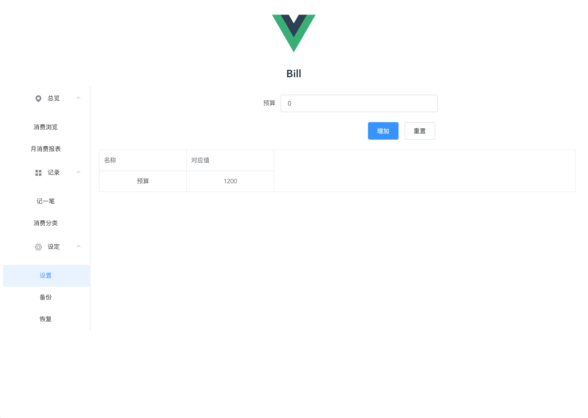

# Bookkeeping
在线记账本----[前端](https://github.com/RebornL/Bookkeeping)
在线记账版----[后端](https://github.com/RebornL/BookkeepingBackend)
## 前言
使用vue+vue-royter+element-ui+axios，vue-router确实好用，element-ui文档和解决方案也很不错（不断切换使用iView，fish-ui，vux等vue的ui，发现还是element-ui靠谱）

## 安装
首先要确保已经安装了node和npm，然后将项目clone下载
```node
npm install
```
之后运行，
```node
npm run dev
```
打开http://localhost:8080



